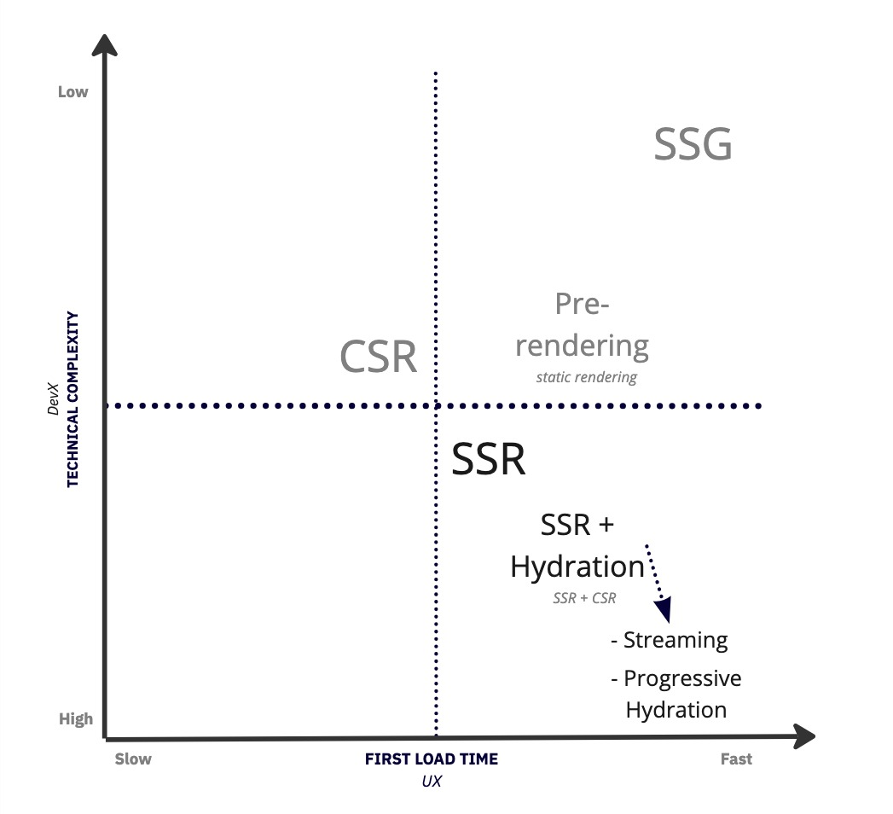

# Hydration React

This repo contains examples of how React uses hydration and rendering. This is purely for educational purposes. The ideal state is to have a very fast and optimal React application. The examples will be very simple, the concept is more important. Hydration is the concept of when something got rendered on the server side, that the events will be taken over on the client side. The server renders static HTML, the client takes over and makes it interactive. Below is an image to show on a DevX / UX scale, how we can map all the known approaches.

To highlight the differences on a scale between DevX and UX, see the image below:

## Disclaimer

Most of these use examples are not something you will be doing yourself, this is a peek at what frameworks like Remix, NextJS, Gatsby, etc. are doing under the hood.

## Technologies Used

- [React](https://react.dev/reference/react/apis)
- [React DOM Client](https://react.dev/reference/react-dom/client)
- [React DOM Server](https://react.dev/reference/react-dom/server)
- [React Router DOM](https://reactrouter.com/en/main)
- [Express](https://expressjs.com/)
- [Babel](https://babeljs.io/)
- [esbuild](https://esbuild.github.io/)
- [http-server](https://www.npmjs.com/package/http-server)

## Prerequisites

You have worked with React or know what it is. If not, please check [React](https://react.dev/).

## Used React features

React supports both client and server side rendering. We'll use both approaches. I added links to the docs on the React site for more information.

### Client API

- [createRoot](https://react.dev/reference/react-dom/client/createRoot) (no hydration support, added for comparison)
- [hydrateRoot](https://react.dev/reference/react-dom/client/hydrateRoot)

### Server API

- [renderToStaticMarkup](https://react.dev/reference/react-dom/server/renderToStaticMarkup) (no hydration support, added for comparison)
- [renderToString](https://react.dev/reference/react-dom/server/renderToString)
- [renderToPipeableStream](https://react.dev/reference/react-dom/server/renderToPipeableStream)

## Scripts

For simplicity I added a script per case that will make sure if both server and client are needed, they will run in parallel. The scripts are:

### No Hydration

- `npm run start:csr` - This will run a basic client-side-rendered example.
- `npm run start:ssg` - This will run a simple static site generated example.

### With Hydration

- `npm run start:ssr-1` - This will run the renderToString example
- `npm run start:ssr-2` - This will run the renderToPipeableStream example

## Reach out

If you have any questions, create an ISSUE/PR here on Github or reach out to me on [LinkedIn](https://linkedin.com/martin-demiddel).
